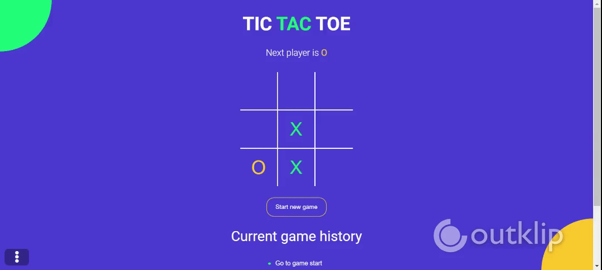

# Tick Tac Toe

## Overview

The Tic Tac Toe game in React.

_Instructor : Andrew Hulenko_


# Output





# Stack:

- React
- Styles with Saas


## Develop Locally

1. Clone this Repo by running

```
https://github.com/Yashwithagit/ticktactoe.git
```

2. Install dependencies by running

```
npm install
```

3. Run on Terminal

```
npm run start
```


## Deployment

Deployed to surge.sh -> https://surge.sh/help/getting-started-with-surge


## Reference

 guided Project by [Internshala Training](https://trainings.internshala.com/)
